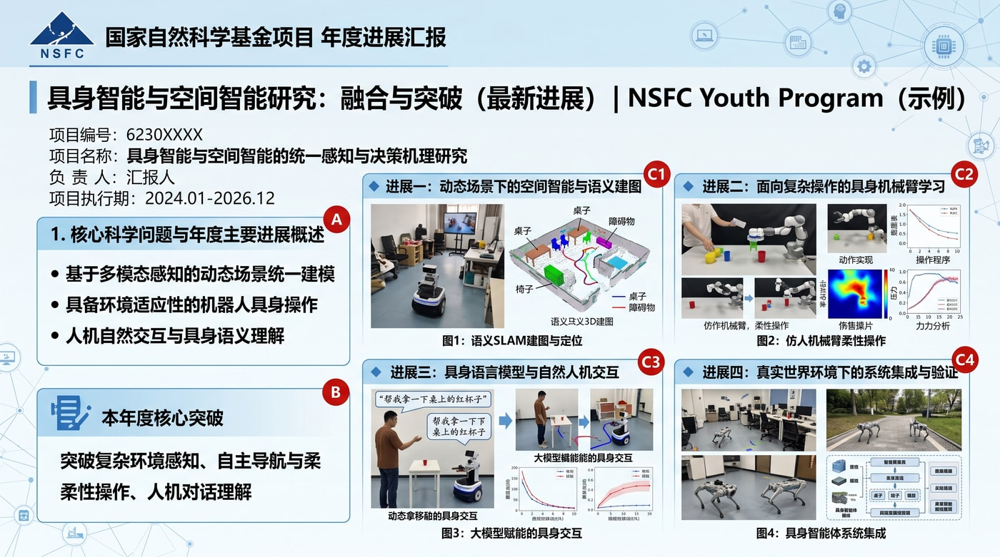
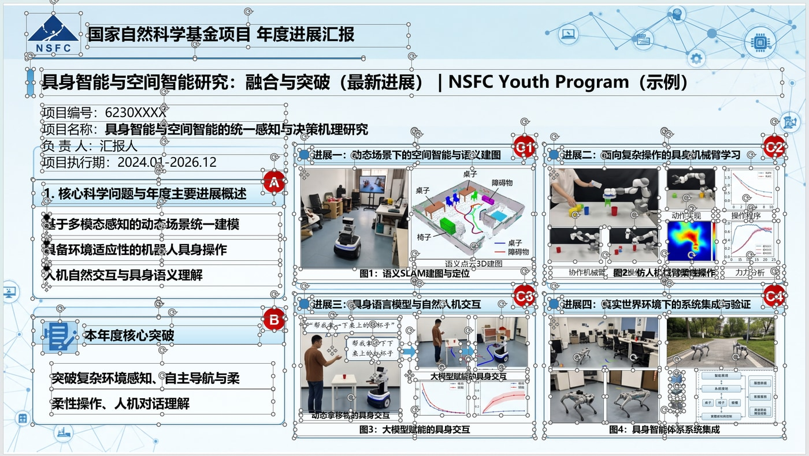
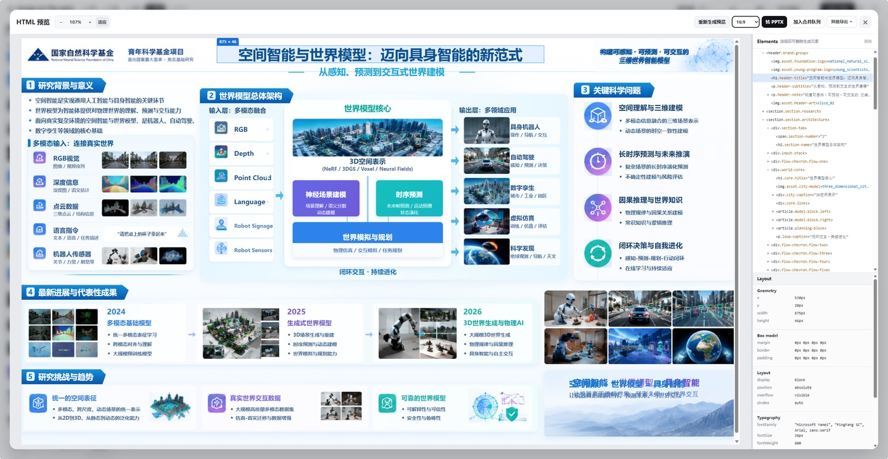
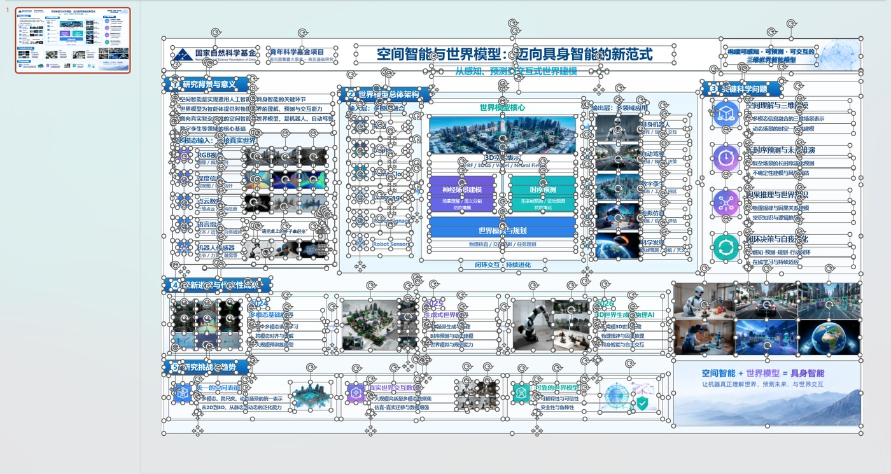

# image-to-fig-pptx

**把一张平面图片变成可编辑的 PowerPoint。** 图片 → 一键切图 → 人工校准 → HTML/CSS → 原生 PPTX 对象。

产物是 PowerPoint **原生对象**（真实文本框、图片、图形），不是整页截图。中间产物是一份可人工校准、可离线交付的 HTML/CSS。

本项目的切图与 HTML 重建能力，改编自 [50kg/image-to-slice](https://github.com/50kg/image-to-slice)。**请先阅读文末的[致谢](#致谢)。**

---

## 用之前必须先做这一步

> ### 打开界面后，**先去左下角点「设置」**，把两个模型配好并保存，**然后再载入图片。**
>
> 这一步不做，界面上的「一键切图」和「生成 HTML」都是灰的，**什么都干不了**。
>
> ### 两个模型都必须配，且必须用够新的：
>
> | 用途 | **必须使用** | 「设置」里的分组 |
> | --- | --- | --- |
> | **图片理解**（识图、理解画布） | **gpt5.6 及以上** | 图片理解 |
> | **图片生成**（生图、补图、抠图） | **image2** | 图片生成 / 图片修补 |
>
> 用更旧或更弱的模型，拆图会把该保留的素材漏掉、把该重建的文字当成图片，**最终 PPTX 的可编辑程度会明显变差**。

**配置顺序：**

```text
1. 打开界面 → 左下角「设置」→ 新建两个 API
     · 图片理解   → 模型填 gpt5.6 以上
     · 图片生成   → 模型填 image2
   每个都填 Base URL / 模型 ID / API Key，点「测试」通过后保存
2. 回到主界面，载入图片（「本地图片」或「AI生图」）
3. 一键切图 → 人工调整 → 生成 HTML → 转 PPTX
```

---

## 目录

- [用之前必须先做这一步](#用之前必须先做这一步)
- [它解决什么问题](#它解决什么问题)
- [效果](#效果)
- [工作流](#工作流)
- [获取与运行](#获取与运行)
- [环境要求](#环境要求)
- [目录结构](#目录结构)
- [关于 API Key 与成本](#关于-api-key-与成本)
- [和其他方案的区别](#和其他方案的区别)
- [常见问题](#常见问题)
- [致谢](#致谢)

---

## 它解决什么问题

GPT Image、Nano Banana 这类模型生成的 PPT 效果图观感很好，但直接丢给大模型做还原，输出往往惨不忍睹：**它分不清哪些内容可以用代码或原生对象表达，哪些只能作为静态素材保留。**

纯截图贴回 PPT 则走向另一个极端 —— 好看，但一个字都改不了。

本项目的做法是**先拆、再校、最后结构化转换**：

1. 把图片拆成「可原生重建的部分」与「必须保留为素材的部分」；
2. 让人来校准拆得对不对（AI 只给建议，不是最终答案）；
3. 重建为 HTML/CSS，再把计算结果确定性地映射成 PPTX 原生对象。

因为最后一步是**确定性转换**而不是让模型重新画一遍，同样的 HTML 必然得到同样的 PPTX，不会出现每次结果不一样、或凭空编造内容的情况。

---

## 效果

### 案例一：平面图片 → 可编辑 PPTX

一张国家自然科学基金年度进展汇报的平面图（2741 × 1530），经过切图、人工校准、HTML 重建后转成 PPTX。

| 原图（一张压平的图片） | 转换结果（可编辑 PPTX） |
| --- | --- |
|  |  |

版式、配图、图表位置都保留；**标题与正文是真正的文本框，照片与插图是独立的图片对象**，可以在 PowerPoint 里直接改字、换图、挪位置。

### 案例二：HTML 预览 → 可编辑 PPTX

切图校准完成、生成 HTML 预览之后，在预览界面里就能直接转 PPTX。左侧是重建出的 HTML 渲染结果，右侧是结构检查面板（DOM 树、盒模型、文字样式）。

| 生成 HTML 预览 | 转换结果（可编辑 PPTX） |
| --- | --- |
|  |  |

右图是 PowerPoint 里的截图 —— 文字外框上的控制点，是**选中原生文本框**时才有的，不是图片上的装饰。

---

## 工作流

界面顶部有一条进度条，始终告诉你当前在哪一步、下一步做什么：

```text
① 送图  →  ② 切图  →  ③ 调整  →  ④ 预览  →  ⑤ PPTX
```

| 步骤 | 做什么 | 界面上的动作 |
| --- | --- | --- |
| ① 送图 | 载入本地图片，或用 AI 生图 / 图生图产出一张 | 侧栏「本地图片」「AI生图」 |
| ② 切图 | AI 识别需要保留的位图素材，以及需要还原的完整背景 | 顶栏「一键切图」 |
| ③ 调整 | 人工校准：移动、缩放、圆角、隐藏、删除、抠背景、局部补图、转 SVG、**拖动调整层级** | 左侧「切图资产」列表 |
| ④ 预览 | 识别文字与布局，重建为 HTML/CSS | 顶栏「生成 HTML」 |
| ⑤ PPTX | 选比例，转成可编辑 PPTX；多页可加入队列后一次性合并 | 预览弹窗「转 PPTX」 |

**顶栏只会显示当前阶段该用的动作** —— 没有切图之前，「导出切图包」「生成 HTML」根本不会出现，不会误点。

### 具体流程

```text
平面图片
   ↓
① 一键切图：AI 一次请求同时给出切图资产与背景候选
   ↓
② 确认遮挡区域 →「生成完整背景」用 AI 补齐被按钮/文字挡住的背景
   ↓
③ 人工校准切图：坐标、圆角、显隐、抠图、补图、SVG、层级顺序
   ↓
④ 生成 HTML 预览（可反复重新生成）
   ↓
⑤ 转 PPTX：默认缩放到 16:9，也可按 HTML 原比例 / 4:3 / 3:4
```

### 两条可选出口

- **导出切图包（ZIP）**：每个切图 + `manifest.json`。顶栏「导出切图包」右侧有下拉，可切换成 **导出切图到 .fig**，按当前层级前后关系产出 `.fig`，手动导入 Figma 继续调整。**本工具不依赖 Figma 运行。**
- **导出可编辑 .fig**：在 HTML 预览弹窗的「其他导出」里，导出带结构的 `.fig`。

> ⚠️ **未生成 HTML 时，导出的 `.fig` 只包含切图资源，不含文字。** 需要文字请先点「生成 HTML」。界面会就此给出提示。

---

## 获取与运行

有两种用法，**先确认你要哪一种**。

### 方式一：开箱即用（推荐给使用者）

前往 **[Releases](https://github.com/Ye334-git/image-to-fig-pptx/releases)** 下载 `image-to-fig-pptx-v*.zip`。

**依赖全部内置，解压即用** —— 不需要 `npm install`，不需要构建，不依赖任何外部 agent 工具。

1. 解压到任意目录
2. 双击 **`start.cmd`**
3. 浏览器自动打开 `http://127.0.0.1:18789`
4. **先去左下角「设置」配好两个模型并保存**（图片理解用 **gpt5.6 以上**，图片生成用 **image2**）—— 不做这一步后面全是灰的，详见[开头的必读](#用之前必须先做这一步)
5. 载入图片，按顶栏进度条走完五步

解压后的目录里有 `verify.cjs`，建议先自检：

```
node verify.cjs
```

它会检查包是否完整、本机是否具备运行条件，并且**真实生成一个 PPTX** 来确认链路通畅。不需要任何 API Key，也不写入你的数据目录。

命令行参数：`--host`、`--port`、`--data-dir`、`--no-open`、`--help`。

### 方式二：从源码运行（给要改代码的人）

> **本仓库里只有源码**，不含 `node_modules`，也不含预构建界面。直接 clone 下来**跑不起来**，必须先安装依赖并构建。

```powershell
git clone https://github.com/Ye334-git/image-to-fig-pptx.git
cd image-to-fig-pptx

# 1. 引擎依赖（playwright-core、sharp、jszip …）
cd tools/image-to-html  ; npm install
# 2. 转换器依赖（dom-to-pptx、puppeteer、jszip）
cd ../html-to-pptx      ; npm install
# 3. 构建界面（dist/ui.html 是构建产物，不入库）
cd ../image-to-html     ; npm run build
# 4. 启动
cd ../image-to-pptx     ; npm start
```

> ⚠️ **注意区分两个 `start.cmd`：**
> - **发行包**根目录的 `start.cmd` —— 就是本项目的正确入口，双击即用。
> - **源码仓库**根目录的 `start.cmd` —— 是仓库里遗留的旧脚本，启动的是上游 image-to-slice（端口 18787 / 18788），**不是本项目**。从源码运行时不要点它。

---

## 环境要求

| 依赖 | 用途 | 缺失后果 |
| --- | --- | --- |
| **Windows x64** | 原生依赖（sharp、vectorizer）与 PowerPoint 自动化 | 无法运行 |
| **Node.js ≥ 20.19** | 运行时 | 无法启动 |
| **Google Chrome 或 Microsoft Edge** | HTML 预检与 DOM 读取 | 禁用「转 PPTX」 |
| **Microsoft PowerPoint** | 多页合并与逐页预览渲染 | 禁用「转 PPTX」 |
| 模型 API Key | 切图、HTML 重建 | 禁用切图与 HTML 重建 |

缺失 Chrome / PowerPoint / Key 时**只会禁用对应功能**，其余照常可用，并在界面上说明原因。

> `sharp`、`@neplex/vectorizer` 是 Windows x64 原生模块，因此**本项目只能在 Windows x64 上运行**。这与「转 PPTX 依赖 Windows + PowerPoint」是一致的。

---

## 目录结构

### 本仓库（源码）

```text
image-to-fig-pptx/
├── README.md
├── docs/
│   ├── dev/                     需求、spec、tickets、验收记录
│   └── images/                  README 里的对比图
├── tools/
│   ├── image-to-pptx/           启动器 + 打包脚本（standalone/ 是发行包外壳）
│   ├── image-to-html/           切图 / HTML 引擎（server.js + src/ui + tests）
│   └── html-to-pptx/            HTML → PPTX 转换器
├── image-to-slice/              上游 image-to-slice 源码归档（MIT）
├── htmls/                       示例产出
└── 1.png / 2.png / 3.png        示例输入
```

### 发行包（Releases 里的 zip）

```text
image-to-fig-pptx/
├── start.cmd                    双击启动
├── verify.cjs                   自检脚本
├── bin/image-to-fig-pptx.cjs    启动器
├── docs/images/                 对比图
├── engine/                      引擎（含预构建界面 dist/ui.html 与 node_modules）
├── converter/                   转换器（含 node_modules）
├── examples/demo-slide/         自检用示例页面
└── data/                        模型配置与工作区记录（首次运行后生成）
```

发行包由 `tools/image-to-pptx/scripts/build-standalone.ps1` 从本仓库生成，**整个文件夹可复制到任意位置运行**，不依赖本仓库。

---

## 关于 API Key 与成本

### 必须配置的两个模型

| 用途 | **必须使用** | 「设置」里的分组 |
| --- | --- | --- |
| **图片理解**（识图、理解画布） | **gpt5.6 及以上** | 图片理解 |
| **图片生成**（生图、补图、抠图） | **image2** | 图片生成 / 图片修补 |

**两个都要配。** 只配一个时，依赖另一个的功能会被禁用。

### 哪些环节需要 Key

| 环节 | 需要 Key 吗 |
| --- | --- |
| 一键切图、AI 补背景、抠背景、重绘、生成 HTML 预览 | 需要（用上面两个模型） |
| **HTML → PPTX** | **不需要** |
| 多页合并、逐页预览渲染 | 不需要 |

**「HTML → PPTX」这一步完全在本机完成**：本机浏览器读取计算样式 → 本地 DOM 转换库映射为原生对象 → Microsoft PowerPoint 合并与渲染。不发起网络请求、不调用模型。

Key 由使用者自行填写（Base URL、模型 ID、API Key），**成本完全自控**。**未配置任何可用 Key 时，第一步切图会被禁用** —— 所以务必先完成[开头那一步](#用之前必须先做这一步)。

---

## 和其他方案的区别

|  | 纯截图贴回 | AI 一键出 PPT | 本项目 |
| --- | --- | --- | --- |
| 文字可编辑 | ❌ | 通常可以 | ✅ |
| 结果稳定可复现 | ✅ | ❌ 每次不同 | ✅ 确定性转换 |
| 中间产物可人工校准 | ❌ | ❌ 一锤子买卖 | ✅ 切图与 HTML 都可检查 |
| 可交付 HTML/CSS | ❌ | ❌ | ✅ |
| 需要 API Key 才能出 PPTX | — | 需要 | **不需要** |

关键差异在于**人工校准环节**与**可检查的中间产物**：AI 拆得不对可以自己改，而不是重跑一次抽奖。

---

## 修改界面

界面源码在 `engine/src/ui/`，但服务实际加载的是**预构建**的 `engine/dist/ui.html`。改完源码必须重建：

```
cd engine
node scripts/build-ui-html.js
```

否则浏览器里看到的仍是旧界面。重建需要 `engine/node_modules` 存在（已随包提供），不需要联网。

---

## 常见问题

**启动报「安装包不完整」**

说明 `bin` 之外的内容没复制全。请重新解压完整包，不要只复制 `bin` 目录。

**「转 PPTX」是灰的**

把鼠标停在按钮上看提示，会写明具体缺什么（未找到 Chrome/Edge、未安装 PowerPoint 等）。也可以运行 `node verify.cjs` 看详细诊断。

**切图按钮是灰的 / 提示先配置模型**

第一步切图需要「图片理解」模型。到「设置模型」里配置并测试通过即可。

**端口被占用 / 双击了但页面没变**

```
node bin/image-to-fig-pptx.cjs --port 18800
```

若已有实例在运行，启动器会直接复用它并提示，不会崩溃。页面若是旧的，按 `Ctrl + F5` 强制刷新。

**生成的图片方向不对**

侧栏选中的「选片比例」决定实际像素尺寸。若结果与预期不符，点一下该比例按钮重新确认。

---

## 致谢

### 特别感谢 [50kg/image-to-slice](https://github.com/50kg/image-to-slice)

**本项目的切图与 HTML 重建能力，直接改编自 [@50kg](https://github.com/50kg)（liu chao）的 image-to-slice 1.1.2。**

没有这个项目，就没有本项目。它把「面向 UI 开发场景的图片拆解」这件事想得很清楚：

- **提出了「AI 切图」这个概念本身** —— 面向 UI 开发的图片拆解，要回答的不是「这张海报该怎么重新编辑」，而是「这张 UI 应该怎样开发」：哪些内容适合用代码或原生节点还原，哪些必须保留为图片素材。这个判断，是本项目全部价值的地基。
- **AI 拆图 + 人工校准的产品形态** —— AI 只给建议，由用户通过框选、移动、缩放、圆角、隐藏、删除、替换来最终拍板。本项目原样继承了这一整套交互。
- **遮挡区域的识别与 AI 补齐** —— 把盖在背景上的界面元素作为修补蒙版移除，再依据上下文补齐背景，并同时给出「AI补齐·原图」与「AI补齐·局部合成」两个版本，让人自行取舍而不是由程序代判。
- **完整的切图资产处理能力** —— 抠背景、画笔与橡皮擦局部修补、SVG 描摹建议与还原、按原始坐标导入 Figma。
- **HTML/CSS 重建与离线打包** —— 把切图与文字布局重建为自包含的 HTML，这正是本项目接上 PPTX 转换的接口。

本项目的引擎部分（`engine/`）来自 image-to-slice 的源码，其中 `.fig` 导出相关模块与上游**逐字节一致**；我们做的主要是把它从 Figma 插件形态中抽离出来、作为本地 Web 应用运行，并在其后接上 PPTX 转换。上游采用 MIT 许可证，本项目继续沿用，许可证见 `engine/LICENSE`。

如果你觉得这个项目有用，**请也给上游点一个 Star** —— 真正解决「图片该怎么拆才对」这个问题的是它。

### 其他开源项目

| 项目 | 用途 |
| --- | --- |
| [atharva9167j/dom-to-pptx](https://github.com/atharva9167j/dom-to-pptx) | 读取浏览器计算样式，把 DOM 映射为 PowerPoint 原生对象 |
| [puppeteer](https://github.com/puppeteer/puppeteer) | 驱动本机 Chrome/Edge 做 HTML 预检 |
| [sharp](https://github.com/lovell/sharp) | 图片裁剪、缩放与透明处理 |
| [JSZip](https://github.com/Stuk/jszip) | 切图包与 HTML 包打包 |
| [openfig-core](https://github.com/nickfogle/openfig-core) | `.fig` 文件编码 |

---

## 许可证

MIT。引擎部分继续沿用上游 [50kg/image-to-slice](https://github.com/50kg/image-to-slice) 的 MIT 许可证，见 `engine/LICENSE`。
